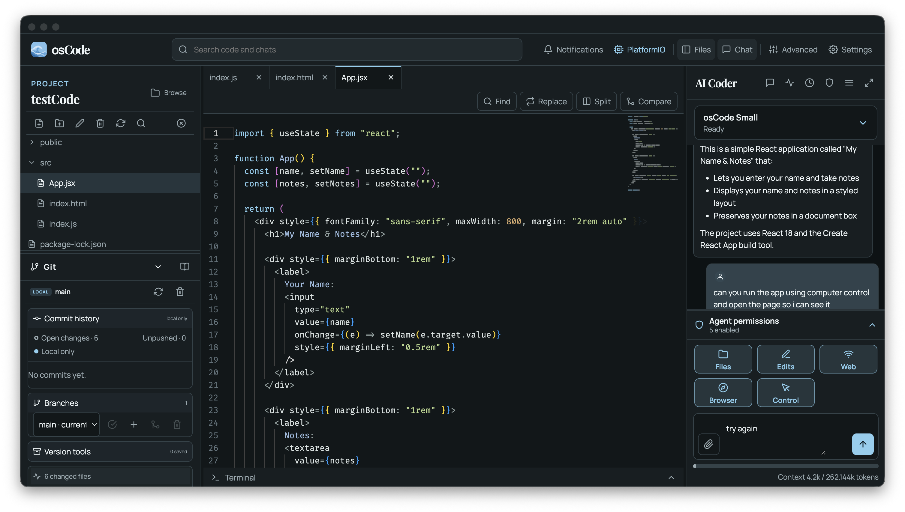
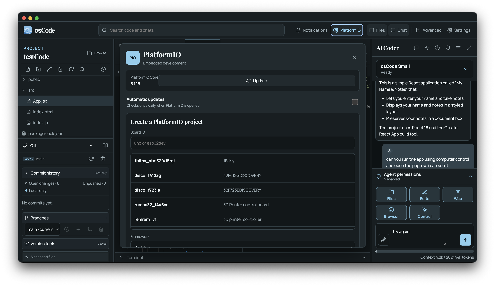

<p align="center">
  
</p>


<p align="center">
  <a href="assets/screenshots/0001.png">
    
  </a>
</p>

<p align="center">
  <a href="assets/screenshots/0002.png">
    
  </a>
</p>

<p align="center">
  <a href="assets/screenshots/0003.png">
    
  </a>
</p>

<p align="center">A private, local-first AI chat and productivity workspace.</p>

osChat combines a familiar conversational interface with native document, spreadsheet, and presentation workspaces. Its local agent can research public information, create and revise files, build interactive response widgets, and collaborate beside each editor without requiring a cloud account.

## What is included

- Local Small, Medium, and Large model tiers from the shared verified osCode model catalogue
- Custom GGUF, MLX, PyTorch, and Ollama models
- Rich documents with DOCX export
- Formula-aware spreadsheets with XLSX export
- Slide editing, speaker notes, presentation mode, and PPTX export
- Interactive tables, charts, metrics, and editable artifacts inside chat
- Scoped permissions for files, terminal commands, public web research, the agent browser, MCP, and Computer Control
- Receive-only web safeguards, prompt-injection protection, local encrypted app data, and no telemetry
- Shared single-pipeline inference across multiple windows, with queued work preserved per chat

## Desktop support

- macOS 12 Monterey or newer on Apple silicon and Intel
- Windows 10 and Windows 11 on x64
- Linux on x64 through the native Debian package

Native installers are built on their target operating system with the scripts in `releaseScripts`. Generated installers are staged in the ignored `release-assets` directory for manual publication.

## Development

Install Node.js and pnpm, then run:

```bash
pnpm install
pnpm dev
```

Useful checks:

```bash
pnpm typecheck
pnpm test
pnpm smoke
```

Model weights are downloaded only when a user chooses a tier. The current updater channel structure remains in place while the dedicated osChat release repository is prepared.

## Privacy and safety

Attachments are decoded locally and are never used to form web queries. Public web content is treated as untrusted reference data. Any action that could send private context outward requires a distinct exact approval, and destructive file operations always use the operating system Trash or Recycle Bin confirmation flow.

## Contributing

Contributions are welcome through pull requests. Changes are reviewed by the project owner before they are merged; opening a pull request does not automatically approve or publish it.

## License

MIT
